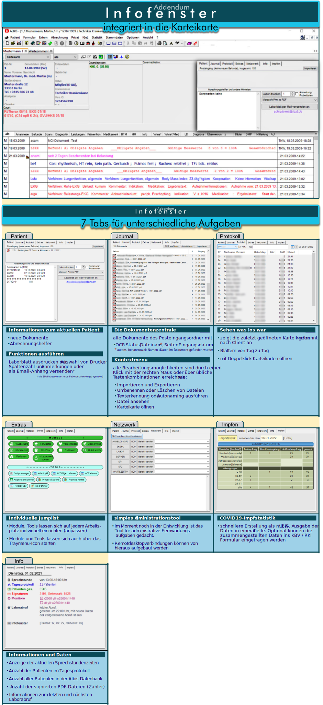
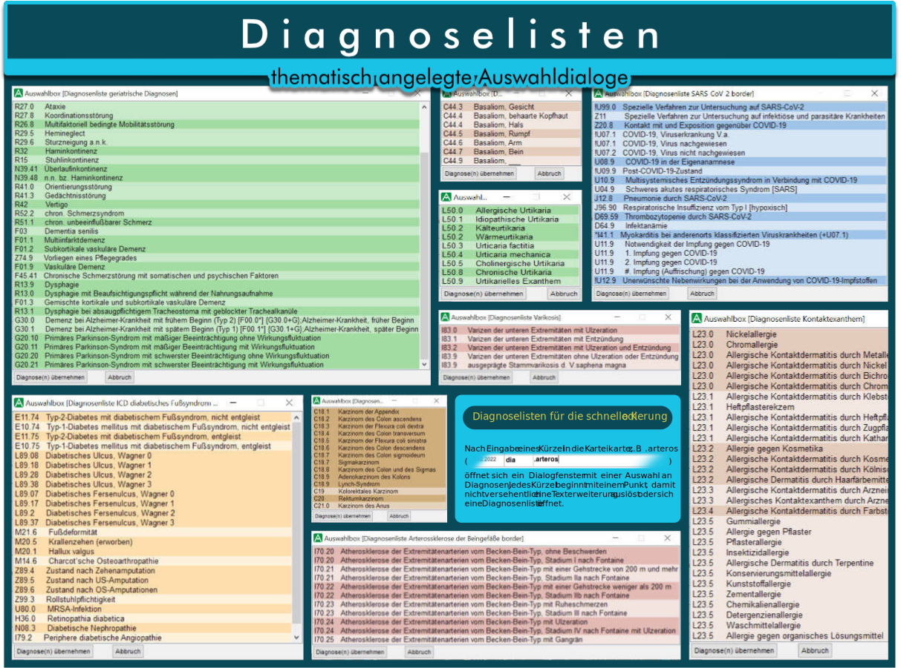
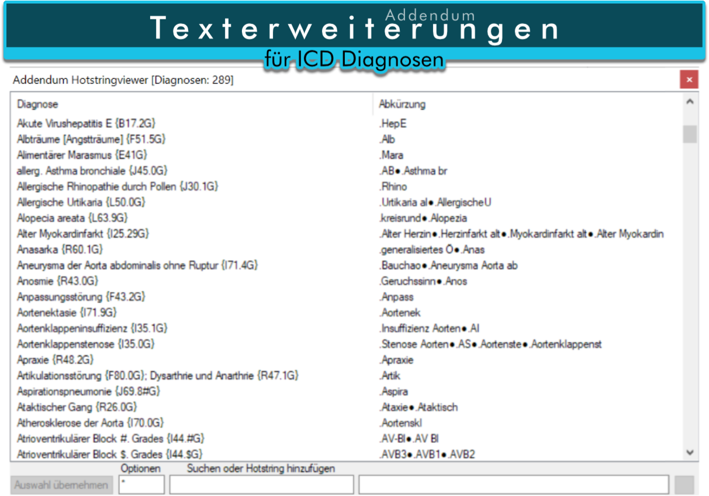
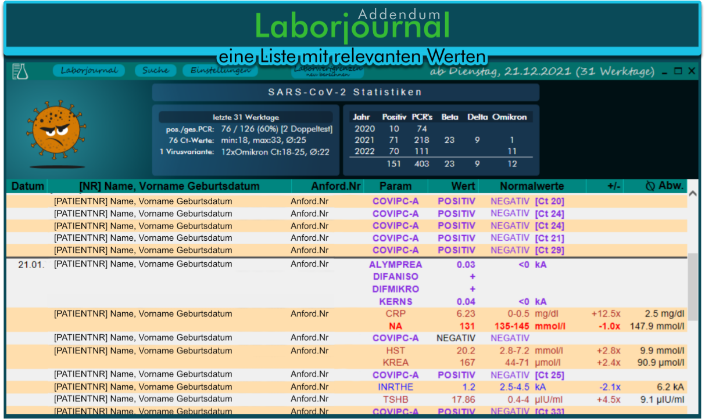
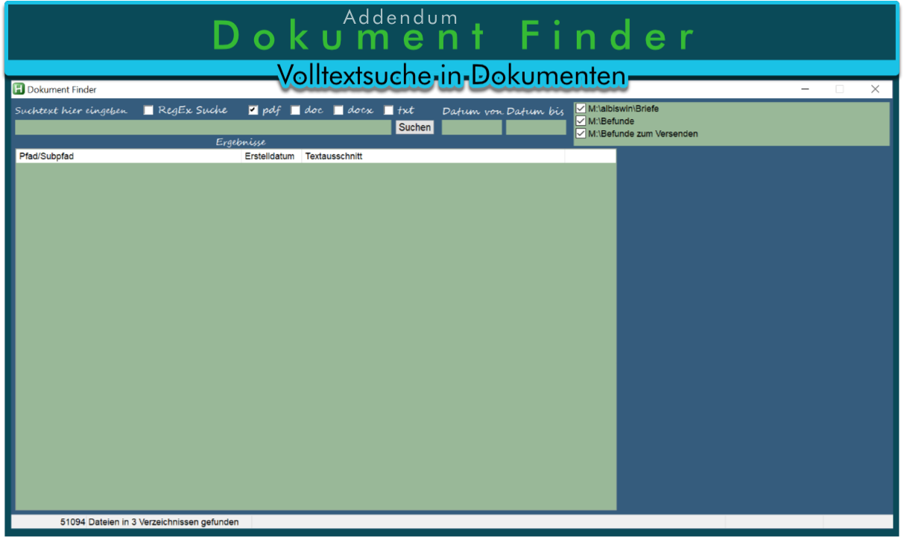
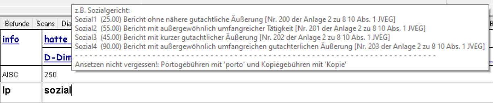
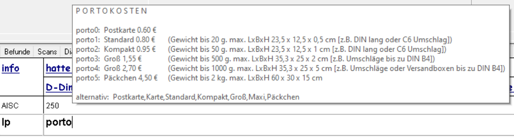
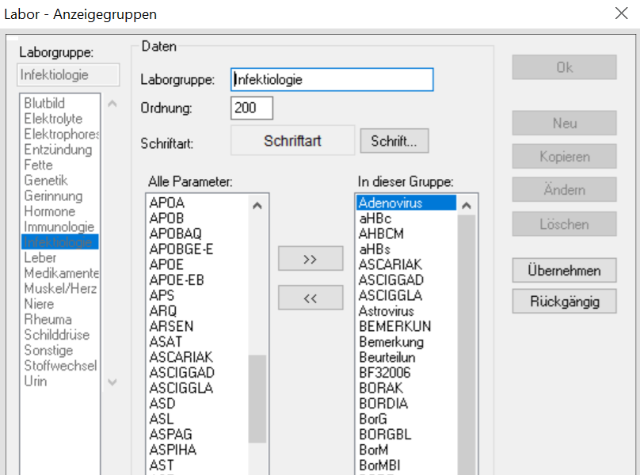
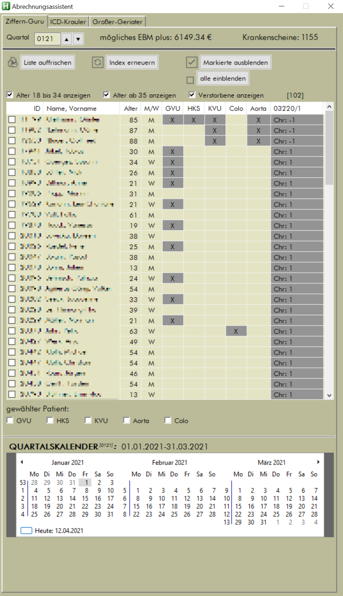

#### Extends the possibilities through surface analysis and manipulation

### V2.0 vom 17.06.2022


### DIES IST KEINE OFFIZIELLE ERWEITERUNG FÜR ALBIS!
##### Der Hersteller der Praxissoftware Albis*, die Compugroup AG, hat mit dieser Software nichts zu tun, geschweige denn, wurde diese offiziell durch die CompuGroup AG legitimiert!
###### * Arztinformationssystem (AIS), Arztsoftware, Praxissoftware, Praxisverwaltungssoftware, Praxisverwaltungssystem (PVS), Praxismanagementsoftware oder Ordinationsmanagementsoftware


## ddendum Funktionen


### 🔳 <u>Fensterhandler</u>

- ⛔ Popup- und Werbeblocker für Albis und andere Programme
- 🖥 Window-Autosizer


### <u>Albis</u>

- Auto-Login
- Suche im Albismenu
- ⌨ Vereinfachung der Bedienung durch logische Tastenkombinationen
-  **Albis Reanimator**: ein abgestürztes Albis und/oder seine Komponeten beenden und neustarten
- 💾 **Patientendatenexport**


### 📄 <u>Dokumente</u>

- 💡 **Auto-OCR** mit Tesseract
- 👪 automatische Erkennung von Patientennamen und des Dokumentdatums aus dem Dokumenttext
-  **Autonaming** für Dokumente (automatische Klassifizierung von PDF-Dokumenten)
- ✍ Unterstützung für **PDF-Signierung**
- **Dokument Finder** - Volltextsuche in PDF-Dokumenten


### 🗃 <u>Karteikarte</u>

-  integriertes **Addendum Arbeitsfenster**
- 🖨 direkter **Dokumentexport** und **-druck**
-  **Rezepthelfer**
- 📝 **Kontextsensitive Texterweiterungen**: Diagnosen, Gebühren, ...
-  **Arbeitsunfähigkeitsbescheinigung**: Anzeige von Beginn und Ende der Lohnfortzahlung


### 💉 <u>Impfstatistik</u>

- 📊 berechnet COVID-19-Impfungen nach Vorgabe der KBV / RKI


### ☎ <u>FritzBox AnrufMonitor</u>
Erkennen Sie dringende Anrufe und rufen Sie die Anrufer zurück!<br>
- zeigt die Telefonnummern aller nicht angenommenen Anrufe des aktuellen Tages an
- die Anrufhäufigkeit wird für jede Telefonnummer erfasst und angezeigt
- zeigt die Anrufer mit Klarnamen an, wenn die Telefonnummern eingetragen sind
- kann sein eigenes Telefonbuch führen
- bietet Filtermöglichkeiten
	- kann bestimmte Telefonnummern ignorieren
	- automatische Faxerkennung
	- zu überwachende eigene Telefonnummern sind einstellbar
- führt eine Anrufstatistik (im Moment Ausgabe nur als Textdatei)


####   <u>Funktionsbibliotheken</u>

- ⌨ Funktionen für die Albismanipulation
-  **medizinische Berechnungen**
- 📀 **dBase**: native Funktionsklasse zum Lesen von Daten
- ⚗ **Addendum_LDT** - dekodiert Dateien der elektronischen Labordatenübertragung (LDT-Format), hilfreich um nicht importierte Labordaten aufzufinden


###  ⚗ <u>Laborhelfer</u>

- 📞 **Laborabruf** - automatisch zu bestimmten Tageszeiten

- 📥 **Laborimport** - automatisch neue Werte in die Laborblätter aufnehmen lassen

- 📜 **Laborjournal** - Zusammenstellung klinisch relevanter Werte der letzten Werktage

- **EMailversand** eines Laborbefundes direkt aus dem Patienten Laborblatt


### 💰 <u>Abrechnung</u>

- **Abrechnungsassistent** - vergessenes, doppelt abgerechnetes schneller finden und korrigieren, integrierte Vorsorgeassistent für Hausärzte


###  ⛽ <u>weiteres</u>

- 📧 **Outlook** **Anhänge** extrahieren
-  **PushToTelegram** - EMails an den beliebten Messenger senden
- 🔎 **QuickSearch**: Analyse und Suche von Daten in allen Albis (dBase) Dateien
- 👪 **Patientensuche**: beliebige Kriterien für die Suche nach Patienten


[alle Änderungen in Addendum](Docs/Changes_Addendum_main.md)   |   [alle Änderungen in den Funktionsbibliotheken](Docs/Changes_Addendum_includes.md)


##  *WICHTIG*

- Ich empfehle die Skripte **nicht** zu **kompilieren!**

- **Entpacken** Sie die Dateien am besten **auf ein Netzwerklaufwerk** auf das sämtliche Computer in Ihrem Netzwerk Zugriff haben. Alle Skripte greifen auf eine gemeinsame Einstellungsdatei zurück (Addendum.ini), damit z.B. bei Neuinstallation eines Computer sämtliche Einstellungen noch vorhanden sind und nicht extra gesichert werden müssen.

- Lassen Sie die Skripte am besten in den Ordnern in denen diese nach Entpacken sind, da die Programmbibliotheken per relativem Pfadbezug hinzugeladen werden

- es lohnt sich nicht ein einzelnes Skript herunter zu laden, da Bezüge und Aufrufe untereinander bestehen, manche Skripte kommunizieren auch untereinander.

- **DENKEN** sie immer an den **BACKUP** ihrer wichtigen Daten!


Da alles in Autohotkey geschrieben ist, läßt sich sämtlicher Code in einem normalen Texteditor lesen (Einschränkung: 4 Funktionen mit Maschinencode (Assembler) - einsehbar im Autohotkey-Forum).

#### *RECHTLICHE HINWEISE UND DIE LIZENSIERUNGSBEDINGUNGEN FINDEN SIE AM ENDE DES DOKUMENTES!*


<br>


<br><br><br>

<br>





- es können mehrere Diagnosen gleichzeitig ausgewählt und übernommen werden
- weitere Listen können im Skript angelegt werden
- Optionen (wie Farben, Schriftart, Schriftgröße) werden als erstes Item im Array oder als zweiter Parameter der Funktion übergeben.<br> Beispiel als Skriptcode:

```Autohotkey
:X*:.Varizen:: Auswahlbox(["title=Diagnosenliste Varikosis border=on BgColor1=E4BBB4 BgColor2=F3E4E0"
               	    	, "Varizen der unteren Extremitäten mit Ulzeration {I83.0G}"
	           	    	, "Varizen der unteren Extremitäten mit Entzündung {I83.1G}"
	           	    	, "Varizen der unteren Extremitäten mit Ulzeration und Entzündung {I83.2G}"
	             		, "Varizen der unteren Extremitäten ohne Ulzeration oder Entzündung {I83.9G}"
	           	    	, "ausgeprägte Stammvarikosis d. V.saphena magna {I83.9G}"])
```

- ICD Diagnosen erhalten je nach Kapitel [A,B,C,D,E,...Z] zu schnellen visuellen Unterscheidungen verschiedene Farben. Bei Angabe von Parametern in den Optionen überschreiben diese die Voreinstellungen.





- Diagnosen erweitern sich in der Karteikarte und in geeigneten Formularfeldern (Diagnosenhotstrings beginnen immer mit einem Punkt (**.**) !)
- fällt Ihnen eine passende Abkürzung nicht mehr ein, einfach ein Sternchen (*****) eingeben und es öffnet sich ein Dialogfenster mit allen passenden oder auch allen vorhandenen Hotstrings
- im Feld „Suchen oder Hotstring hinzufügen” nach einem oder mehreren Teilen im Diagnosetext suchen lassen. Gibt es keinen Treffer wird die Suche automatisch auf die komplette ICD-10-GM Liste ausgedehnt. (inkrementelle Suche)


<br>


- ***Responsives interaktives Webinterface*** (Basis: Internet Explorers).

- ***Gruppierung der Laborparameter*** nach klinischer Bedeutung, erkennbar durch die dickere Schrift und die unterschiedliche farbliche Hervorhebung.

   ’‘**immer**‘’ (Anzeige: immer (nur) wenn pathologisch) und  ‘’**exklusiv**‘’ (Anzeige: auch bei Normwert).

- ***durchschnittliche Über- oder Unterschreitung:***

  - Berechnet die durchschnittliche prozentuale Über- bzw. Unterschreitung der Normwertgrenzen je Laborparameter.
  - Für eventuelle Anpassungen wird die maximale Über- oder Unterschreitung als Einzelwert gespeichert.
  - Durch Nutzung eines Faktors (Prozentwert) erscheinen mir, die durch Annährung erreichten "Warngrenzen", auch bei unterschiedlichen			Einheiten und altersabhängigen Normwertgrenzen klinisch bedeutsame Laborwertveränderungen sicher herauszufiltern.

- **PCR Abstrich Statistik**:

  - zeigt aktuelle pos. SARS-CoV-PCR-Fälle (Anzeigezeitraum) und
  - Zahlen seit Beginn der Pandemie




- kleines Skript hilft Dokumente wiederzufinden

- Skript hat bisher nur wenige Funktionen. Ausgewählte Dokumente werden als Vorschau angezeigt. Dazu ist der Sumatra PDF Reader in die Skript- oberfläche integriert

  [Keine Indexerstellung! Die Suchgeschwindigkeit ist daher sehr langsam!]
  
  


##  neuer Shift+F3 Kalender


##  Menu-Suche


Albis On Windows hat mehr als **740** Menupünkte. Seltene genutzte Formulare zu finden dauert meist ziemlich lange. Drücke  +  für einen Suchdialog und öffne den Menupunkt von hier aus - Danke an *Lexikos* dem Author von Autohotkey für dieses wunderbare Skript.


##  sinnvollere Albiskürzel

- **Kopieren**, **Ausschneiden** und **Einfügen** ist mit den üblichen Kürzeln überall in Albis möglich <br>

  - **Kopieren:**                                      +
  - **Ausschneiden:**                            +
  - **Einfügen:**                                       +

- **weitere Hotkey-Aktionen**

  - **Schließen einer Karteikarte:**   +
  - **zur nächsten Karteikarte:**        +
  - **Laborblatt zeigen:**                      +
  - **Karteikarte zeigen:**                    +
  - **Einstellen des aktuellen Tagesdatums:**   +

- **Hotstrings** (Beispiele)

  - Hotstring: **Kopie** - automatisiert die Berechnung von Gebühren für Kopien nach Eingabe der Seitenzahl<br>**Kopie** bei ***lp*** als aktives Kürzel oder in der Privatabrechnung eingeben. Im folgenden Dialogfenster die Anzahl der Kopien eintragen. Es wird ein zulässiger Abrechnungstext erstellt und in die Karteikarte geschrieben (z.B. ergeben 38 Seiten:   **lp   |** ***(sach:Kopien 38x a 50 cent:19.00)***

    | Hotstring                              | Erweiterung                                             |
    | -------------------------------------- | ------------------------------------------------------- |
    | **JVEG**/**sozialgericht**             | (sach:Anfrage Sozialgericht gem. JVEG:21.00)            |
    | **lageso**                             | (sach:Landesamt für Gesundheit und Soziales:21.00)      |
    | **lagesokurz**                         | (sach:Landesamt für Gesundheit und Soziales:5.00)       |
    | **Rentenversich**/**RLV** oder **DRV** | (sach:Anfrage Rentenversicherung:28.20)                 |
    | **Bundesa** oder **Agentur**           | (sach:Anfrage Bundesagentur für Arbeit gem. JVEG:32.50) |
    | **porto1**/**Standard**                | (sach:Porto Standard:0.80)	; bis 20g                 |
    | **porto2**/**Kompakt**                 | (sach:Porto Kompakt:0.95) 	; bis 50g                 |
    | **porto3**/**Groß**                    | (sach:Porto Groß:1.55)      	; bis 500g              |
    | **porto4**/**Maxi**                    | (sach:Porto Maxi:2.70)       	; bis 1000g            |


  <u>**Einblendung von Tooltips nach partieller Eingabe des auslösenden Hotstrings:**</u>

  

  

<br>


##  Labor Anzeigegruppen

- automatische Erweiterung der Fenstergröße und der Steuerelemente für mehr Übersicht
- weitere Fenster welche sich an die automatisch an die Bildschirmgröße anpassen: Rentenversicherung Befundbericht V015, S0051




##   Schnellrezepte


###  Erweitertes Kontextmenu

**mehr Funktionen im Rechtsklick Menu in der Karteikarte**


Je nach Karteikartenkürzel werden verschiedene Funktionen angeboten. Unter anderem Öffnen eines Formulares zum Bearbeiten oder direkter Druck. Wenn Sie PDF-Dateien oder Bild-Dateien direkt in die Karteikarte ablegen, können Sie diese Dateien ebenso Anzeigen oder Ausdrucken lassen. Und man kann diese in einen nach dem Patienten benannten Dateiordner exportieren (z.B. zur Erleichterung beim Arztwechsel). Versehentlich importierte Befunde lassen sich wieder in den Befundordner unter anderem Namen exportieren. Und da der Faxversand eigentlich auch nur ein Druckvorgang ist, geht auch das inklusive Abfrage der Faxnummer (wenn gewünscht)


<br>


##  Formularhelfer Hausbesuche

**Ausdrucken von Rezepten/Über- und Einweisungen ohne gedrucktes Datum**


* ein Fenster mit 5 Formularen (Kassenrezept, Privatrezept, Krankenhauseinweisung, Krankenbeförderung, Überweisung)
* Auswahl der Formularanzahl 0 für keine und maximal 9 (auch über die Zifferntastatur), nach Eingabe einer Ziffer rückt der Eingabefocus zum nächsten Feld weiter. Ist alles eingegeben, dann nur noch Enter drücken. Den Rest übernimmt das Skript. Es ruft die jeweiligen Formulare auf, entfernt wenn notwendig den Haken am Datumsfeld, setzt automatisch die Anzahl und drückt den Knopf für Drucken.
* im Addendumskript ist ein Hotstring hinterlegt (*FHelfer*). Diesen in irgendeinem Eingabefeld in Albis eingegeben und das Skript startet.
* 1 Mausklick, 7 Buchstabentasten, max. 5 Ziffern und 1xEnter müssen gedrückt werden. **Das wars!** Für einen Hausbesuch sind die Unterlagen vorbereitet. Optional kann für jeden Patienten noch sein Patientenstammblatt ausgedruckt werden.


##  Abrechnungsassistent

- bietet Vorschläge zu bestimmten Abrechnungspositionen zu Patienten an




##  DocPrinz


- **Eingabe** von **Nachname, Vorname, Geburtsdatum oder Patientennummer**
- alle mit den Suchkriterien übereinstimmenden Patienten werden angezeigt
- ein **Klick** auf einen Patienten und alle Dokumente des Patienten werden angezeigt
- **Häkchen setzen** für gezielten Export oder ***‘Alle Dokumente auswählen’*** für eine Komplettauswahl
- ***‘Auswahl exportieren’*** kopiert die Dokumente in einen automatisch erzeugten Unterpfad des Basispfades
-  Laborblatt, Karteikarte und Dokumente lassen sich zusammen exportieren


##  Laborabruf

**Die Automatisierung für den Abruf der Laborwerte**

- der Abruf der Laborwerte ist jetzt nahezu vollständig automatisiert
- Skript erkennt einzelne Abschnitte des Abrufs von Labordaten und übernimmt dann die immer wieder kehrenden Eingabetätigkeiten
- erkannt werden:

  - Öffnen des Labordatenimport-Fensters z.B. nach Aufruf über den Menupunkt Extern/Labor/Daten importieren
    - es wird alles eingetragen was benötigt wird und der Vorgang wird gestartet
    - im Anschluss wird sofort das Laborbuch geöffent
  - im Laborblatt werden nach Aufruf der Funktion ..alle ins Laborblatt.. , sämtliche sich dann öffnenden Dialoge automatisch bearbeitet.Es ist kein weiterer Eingriff durch den Nutzer notwendig.


###     🕗 🕐 🕑 🕒 🕓 🕔 🕕 🕖 🕗 🕘 🕙 🕚 🕛 🕜 🕝 🕞 🕟 🕠 🕡 🕢 🕣 🕤 🕥 🕦 🕧 🕗 🕐 🕑


#  RECHTLICHE HINWEISE

**FOLGENDE ABSCHNITTE GELTEN FÜR ALLE TEILE UND DIE GESAMTE SAMMLUNG DIE UNTER DEM NAMEN** **"Addendum für Albis On Windows"** (nachfolgend Skriptsammlung genannt) herausgegeben wurde

DIE SKRIPTSAMMLUNG IST EIN HILFSANGEBOT AN NIEDERGELASSENE ÄRZTE.

KOMMERZIELLEN UNTERNEHMEN, DIE SICH MIT DER HERSTELLUNG, DEM VERTRIEB ODER WARTUNG VON SOFT- ODER HARDWARE BESCHÄFTIGEN IST DIE NUTZUNG ALLER INHALTE ODER AUCH NUR TEILE DES INHALTES NUR NACH SCHRIFTLICHER ANFRAGE MIT ANGABEN DER NUTZUNGSGRÜNDE UND MEINER SCHRIFTLICHEN FREIGABE GESTATTET! UNBERÜHRT DAVON SIND DIE VON MIR BENUTZTEN FREMDBIBLIOTHEKEN!

DIESES REPOSITORY DARF AUF EIGENEN SEITEN VERLINKT WERDEN.

DIESE SOFTWARE IST **FREIE SOFTWARE**!

DIE SAMMLUNG ENTHÄLT SKRIPTE/BIBLIOTHEKEN AUS ANDEREN QUELLEN. DAS COPYRIGHT SIEHT IN JEDEM FALL EINE FREIE VERWENDUNG FÜR NICHT KOMMERZIELLE ZWECKE VOR. AUS DIESEM GRUND KÖNNEN DIESE SAMMLUNG ODER AUCH NUR TEILE DAVON ZU KEINEM ZEITPUNKT VERKÄUFLICH SEIN! ANFRAGEN JURISTISCHER ODER NATÜRLICHER PERSONEN HINSICHTLICH KOMMERZIELLER ANSÄTZE WERDEN IGNORIERT!
<br>
<br>


#  AGB’s / HAFTUNGSAUSSCHLUSS

**I.a.** Der Download und die Nutzung der Skripte unterliegen der GNU Lizenz welche von Lexikos dem Gründer der Autohotkey Foundation erstellt wurden.

**I.b.** Die Inhalte und Skripte dürfen frei verändert werden. Jegliche Änderung ist vor Weitergabe zukennzeichnen.

#### Download

**II.** mit dem Herunterladen oder Speichern der Dateien in jeglicher Form (entpackt, gepackt, kompiliert, unkompiliert, in Teilen, als Ganzes) übernehmen Sie die volle Verantwortung für deren Inhalt. Ich verlange keinen Nachweis wer die Skripte herunterlädt, plant diese herunter zuladen oder diese vielleicht nie nutzen möchte, oder sogar nutzen will oder wer Veränderungen daran vorgenommen hat oder vornehmen will. Desweiteren akzeptieren sie vollständig alle unter Punkt III stehenden Handlungs- und Haftungsregeln.<BR>

#### Haftungsausschluß / Haftungsfreistellung

**III.** die Nutzung des gesamten Inhaltes (einschließlich Programme, Skripte, Bilder, Bibliotheken, Fremdprogramme) erfolgt auf eigene Gefahr! Das Angebot wurde besten Gewissens auf mögliche Urheberrechtsverletzungen untersucht. Es dürften keine Verletzungen enthalten sein. Quellenangaben sind soweit es nachvollziehbar war in den jeweiligen Dateien enthalten.<BR>

**III.a.** ich übernehme keine Haftung durch vermeintliche, unwissentliche oder eventuell unterstellte, wissentliche Fehler in den Skripten. Programmieren ist Hobby, Leidenschaft und Arbeitserleichterung. <BR>

**III.b.** ebenso übernehme ich keine Haftung für Urheberrechtsverletzungen durch Dritte deren Software oder SourceCode hier verwendet wurde/wird und werden wird. <BR>

**III.c.** Sie akzeptieren das die Skripte nur in einer Alpha-Version vorliegen. Sie sehen den Inhalt als  Beispielprojekt! Die angebotenen Skripte sollen keinen Abrechnungsbetrug ermöglichen, sondern im Gegenteil nur zeigen, welche Möglichkeiten der Einsatz von RPA-Software in der Praxis bringen würde.<BR>

**III.d.** Eine Richtigkeit der in der in der Software hinterlegten Leistungsziffern kann nicht garantiert werden,es liegt in Ihrer Verantwortung alles zu kontrollieren<BR>

**III.e.** sämtliche Automatisierungsskripte können gegen Ihr lokales KV-Recht oder der KBV verstoßen - das Haftungsrisiko übernehmen sie! Die Skripte sind als Beispiele für mögliche Anwendungen durch Nutzung der freien Skriptsprache Autohotkey zu verstehen (siehe auch IIIc).<BR>

**III.f.** Sie haben kein Recht Updates, Fehlerkorrekturen oder eine Behebung von Folgeproblemen (vermeintlich oder beweisbar) einzufordern. Ebenso haben Sie kein Recht Schadensersatz für (vermeintliche oder beweisbare) Fehler zu fordern.<BR>

**III.g.** Insbesondere distanziere ich mich von jeglichen Versuchen meine Skripte für die Überwachung von Mitarbeitern oder anderen Personen einzusetzen.<BR>

**III.h.** Für Fehler in Rechtschreibung, Grammatik bin ich ebenso nicht verantwortlich zu machen. Dazu wenden Sie sich bitte an meine Deutschlehrer.<BR>

**III.i.** ich übernehme keinerlei HAFTUNG aufgrund hier fehlender rechtlicher Hinweise/Aus- oder Einschlüße. Ihnen sollte nach dem Lesen bekannt sein, daß ich keinerlei kommerzielle Zwecke verfolge und die Zusammenstellung der Dateien nicht zum Zwecke eigener Bekanntheit erfolgt und ich deshalb niemals wissentlich oder absichtlich fremdes geistiges Eigentums entwendet habe. Die angebotene Sammlung verfolgt ausschließlich einen gemein-nützigen Zweck.<BR>

<br>
[GNU Licence for Addendum für Albis](Docs/GNU Licence for Addendum für Albis.pdf)


<center> - IXIKO 2022 - </center>

