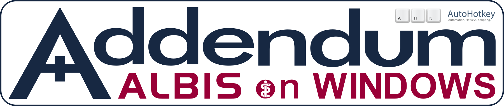
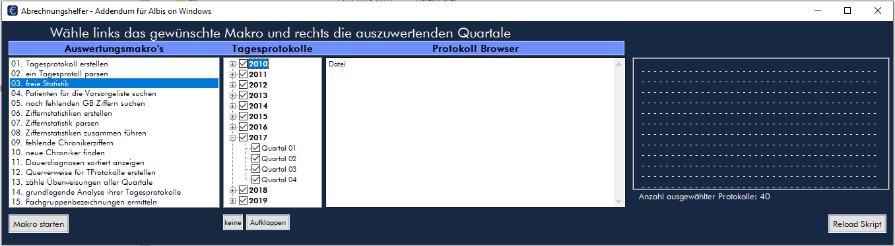

#### Extends the possibilities through surface analysis and manipulation

### preRelease Version 1.51 vom 24.02.2021
lauffähig ausschließlich nur mit *Autohotkey_H ab V1.1.32+ Unicode 64bit* 

geschrieben für Albis ab Version 18.40 (Windows XP,8,10)

### DIES IST KEINE OFFIZIELLE ERWEITERUNG FÜR ALBIS!
##### Der Hersteller der Praxissoftware Albis*, die Compugroup AG, hat mit dieser Software nichts zu tun, geschweige denn, wurde diese offiziell durch die CompuGroup AG legitimiert!
###### * Arztinformationssystem (AIS), Arztsoftware, Praxissoftware, Praxisverwaltungssoftware, Praxisverwaltungssystem (PVS), Praxismanagementsoftware oder Ordinationsmanagementsoftware

    
<h2>&#9733 NEUE FUNKTIONEN SEIT DEM LETZTEM RELEASE</h2>
    

<h3>&#10042; wichtigste Neuerung: Addendum hat Zugriff auf die Albis Datenbanken (DBASE)</h3>

​		die folgenden Module sind deshalb möglich geworden: 

- <h5>Laborjournal</h5>

- <h5>Export von Patientendaten in einem Durchgang (Dokumente, Laborblatt, Karteikarte)</h5>

- <h5>Abrechnungshelfer (ähnlich der Albis internen Funktionen) im Infofenster</h5>

   

<h3> &#10042; neue Erweiterungen für das Infofenster</h3>

- <h5>automatische Texterkennung mit Tesseract (Hotfolder)</h5>      

- <h5>automatische Kategorisierung von PDF-Dateien</h5>

- <h5>Vereinfachung des manuellen Umbennens einer Datei mit Dateivorschau</h5>

  

<h3> &#10042; weitere Funktionen</h3>

- <h5>medizinische Berechnungen, Karteikartenexport (besser als das was die Compugroup anbietet!), automatischer Laborabruf, ein übersichtlicheres Laborjournal, Faxanhänge aus Albis extrahieren, Albis reanimieren und ein bißchen mehr</h5>

  

##  Addendum

<h3> &#9733 PopupBlocker</h3>

- Schließt automatisch diverse störende Albisdialoge und zugehörigen Programmen

<h3> &#9733 Fensterhandler</h3>

- positioniert, erweitert Albisdialoge zur besseren Übersicht innerhalb des Albisfenster damit die Patientenstammdaten immer sichtbar bleiben
- sie können Albis-Dialognachfragen, welche sie seit Jahren immer gleich beantworten, automatische Bestätigen lassen
- erweitert automatisch Anzeige-Elemente in Albisdialogen für mehr Übersicht 
- die im Rezept angezeigte Werbung wird automatisch ausgeblendet
- Albis *kann* individuell an jedem Arbeitsplatz in Größe und/oder Position fixiert werden 

<h3> &#9733 Auto-Login </h3>

- kann auf Wunsch das Login in ihr Albisprogramm vornehmen

<h3> &#9733 eigene Patientendatenbank </h3>

- für eine schnelle und fehlertolerante Suche nach Patienten

<h3> &#9733 Infofenster </h3>

zentral in Albis integriertes Tool für Dokument-Eingänge und Verwaltung des Praxisnetzwerk

- **Patient**: zeigt den Posteingang des aktuellen Patienten und Informationen und Tipps zur Abrechnung an.
- **Journal**: zeigt Dateien des Befundordners an. Hat Funktionen für Texterkennung und automatische Namenserkennung. Befund-/Bilddateien können von dort ohne Umweg in die Patientenakte importiert, angezeigt und umbenannt werden
- **Protokoll**: Anzeige aller zuvor geöffneten Karteikarten des Tages. Der angezeigte Tag kann geblättert werden.
- **Netzwerk:** direkter Start einer Remotedesktopsitzung per Klick 
- **Extras**: häufiger benötigte Programme/Skripte lassen sich im Infofenster anzeigen und von dort aus auch starten

<h3>&#9733 automatische Texterkennung für PDF Dateien</h3>

- mit Tesseract erreiche ich eine bessere Erkennungsrate als mit meinem bisherigen Texterkennungsprogramm
- neu hinzugefügte PDF Dateien werden automatisch in PDF-Text Dateien umgewandelt

<h3>&#9733 automatische Kategorisierung von PDF Dateien</h3>

- findet im Text der PDF den Patientennamen, das Erstellungsdatum des Dokumentes oder den Zeitraum eines Krankenhausaufenthaltes. Aus diesen Informationen wird ein neuer Dateiname generiert.

<h3> &#9733 Unterstützung der PDF-Signierung </h3>

- per Hotkey wird die aktuell im FoxitReader geöffnete PDF Datei signiert. (eine Signatur müssen Sie vorher im FoxitReader erstellt haben). **Achtung:** es gibt keine kostenlose Software zur digitalen Signierung. Den [FoxitReader](https://www.foxitsoftware.com/de/pdf-reader/) müssen Sie bei professioneller Nutzung liszensieren lassen! Ebenso die genutzten Command-Line-Tools - [xpdf-Tools](http://www.xpdfreader.com/) und pdftk.

<h3> &#9733 Menusuche </h3>

- Finden und Aufrufen von Menupunkten im Albismenu

<h3> &#9733 Vereinfachung der Albisbedienung </h3>

- erweiterte Tastenkombinationen (Hotkeys) für zusätzliche Funktionalität
  - **Verschieben von Einträgen** im Dauermedikamenten- und Dauerdiagnosenfenster und im cave! Dialog 
  - **Kopieren**, **Ausschneiden** und **Einfügen** mit der von Windows gewohnten Tastenkombination
  - **Schließen** einer Krankenakte oder **Anzeigen** der nächsten geöffneten
  - Einstellen des aktuellen **Tagesdatums**
  - **Addition** von einer **Woche** oder einem **Monat** in **Datumsfeldern**, anstatt nur einem Tag wie bisher 
  - **neuer Shift + F3 Kalender** zeigt mehrere Monate an 
  - **Hotstrings** für die schnelle Eingabe von Abrechnungsziffern (EBM und GOÄ)

<h3> &#9733 erweitertes Kontextmenu </h3>

- mehr Funktionen im Rechtsklick Menu in der Karteikarte. Bearbeiten (Anzeigen), Drucken, Exportieren, Versand als Fax, per Mail oder per Telegram (Automatisierung für FoxitReader und Sumatra PDF sind integriert)

<h3> &#9733 Rezepthelfer </h3>

- Rezeptvorlagen, z.B. mehrzeilige Hilfsmittelrezepte oder Verschreibung mehrerer Medikamente nach Auswahl einer Vorlage 

<h3> &#9733 schönerer Verordnungsplan und besserer BMP </h3>

* letzteres mag übertrieben sein. Den Bundeseinheitlichen Medikationsplan finde ich furchtbar. Ich habe ein Skript geschrieben das die Vorgaben des BMP imitiert, dabei doch mehr Möglichkeiten und um einiges bessere Darstellungen von Informationen bietet

<h3> &#9733 Anzeige von Beginn und Ende der Lohnfortzahlung  </h3>

- die berechneten Stichtage werden im oberen Teil der Arbeitsunfähigkeitsbescheinigung eingeblendet 

<h3> &#9733 Kontextsensitive Texterweiterungen </h3>

- Erkennung des Eingabekontext in der Karteikarte anhand des Albiskürzel (z.B. lko, dia, bef, info, lp, lbg) 
- Anlegen eigener Textkürzel die sich automatisch zur Leistungskomplexen, Diagnosen, Befundtexten oder anderem erweitern lassen 

<h3> &#9733 Automatisierung DICOM-Daten Umwandlung </h3>

- [MicroDicom](https://www.microdicom.com), der freie DICOM-Viewer für Windows, wird automatisiert für eine schnelle Umwandlung der Daten in Bild- oder Videodateien (im Moment MRT/CT Aufnahmenumwandlung ins wmi Format (video)

<h3> &#9733 RPA-Funktionsbibliothek</h3>

- **118 Funktionen** zur Steuerung von Albis für die Entwicklung eigener Skripte  

<h3> &#9733 native DBASE-Klasse	</h3>	

- für die Analyse der von Albis verwendeten DBASE-Datei Strukturen, Portierung von oder Suche nach Daten

<h3> &#9733 medizinische Berechnungen</h3>	

- Funktionsbibliothek für Berechnungen von BMI, eGFR nach der CKD-EPI Formel, KOF und mehr

<h3> &#9733 Karteikarten exportieren	</h3>	

- Export von Karteikarte, Laborblatt und aller Befunde (Bilder-, Worddokumente und PDF-Dateien) ohne größeren Umweg.

<h3> &#9733 Laborjournal</h3>

- schnelle Übersicht auffälliger Laborwerte der letzten Tage

<h3> &#9733 Laborabruf</h3>

- zeitgesteuerter Abruf von Labordaten mit anschliessendem Import in das Laborblatt der Patienten. Die Uhrzeiten des Abrufs können selbst festgelegt werden.

<h3> &#9733 Outlook Anhänge extrahieren</h3>

- Faxbefunde erreichen mich von der Fritzbox per EMail. Ein neues Skript extrahiert die als PDF angehängten Fax in den Befundordner. Durch die neue Hotfolder-Funktionalität wird dann sofort eine Texterkennung durchgeführt und anschliessend werden die Dateien kategorisiert.

<h3> &#9733 Albis Reanimator</h3>

- Albis hängt sich häufig auf? Mehrmals am Tag sämtliche geladene von Albis geladene Prozesse mit dem Taskmanager löschen damit dann endlich Albis wieder startet. Das macht der Albis Reanimator für Sie und sind sämtliche Prozesse entfernt wird Albis gestartet.

<h3> &#9733 Listview-Inhalte kopieren</h3>

- Sie brauchen den Inhalt des Wartezimmers, die Dauerdiagnosen, die Dauermedikamenten oder die Liste der Resistenztestung aus dem Laborblatt. Steuern Sie ihre Maus über das entsprechende Element und drücken Sie ++ und Addendum kopiert nicht nur den Inhalt des Elementes sondern bereitet ihn auf damit sie ihn z.B. in ein Dokument per Paste einfügen können. 

[alle Änderungen in Addendum](Docs/Changes_Addendum_main.md)   |   [alle Änderungen in den Funktionsbibliotheken](Docs/Changes_Addendum_includes.md)

##  *WICHTIG*

- Ich empfehle die Skripte **nicht** zu **kompilieren!** 

- **Entpacken** Sie die Dateien am besten **auf ein Netzwerklaufwerk** auf das sämtliche Computer in Ihrem Netzwerk Zugriff haben. Alle Skripte greifen auf eine gemeinsame Einstellungsdatei zurück (Addendum.ini), damit z.B. bei Neuinstallation eines Computer sämtliche Einstellungen noch vorhanden sind und nicht extra gesichert werden müssen.

- Lassen Sie die Skripte am besten in den Ordnern in denen diese nach Entpacken sind, da die Programmbibliotheken per relativem Pfadbezug hinzugeladen werden

- es lohnt sich nicht ein einzelnes Skript herunter zu laden, da Bezüge und Aufrufe untereinander bestehen, manche Skripte kommunizieren auch untereinander. 

- **DENKEN** sie immer an den **BACKUP** ihrer wichtigen Daten!

  

Da alles in Autohotkey geschrieben ist, läßt sich sämtlicher Code in einem normalen Texteditor lesen (Einschränkung: 2 Funktionen mit Maschinencode (Assembler) - einsehbar im Autohotkey-Forum). 

#### *RECHTLICHE HINWEISE UND DIE LIZENSIERUNGSBEDINGUNGEN FINDEN SIE AM ENDE DES DOKUMENTES!*

 

##  <u>Laborjournal</u>

 

##  <u>Dauermedikamentenfenster</u>

 

Auswahlmöglichkeit aus voreingestellten Kategorien (in Patienten verständlichem Deutsch). Erreichbar nach Drücken (#) der  Taste in einer geöffneten Zeile. Die Kategorien lassen sich im Quelltext des Addendum.ahk-Skriptes jederzeit ändern. (an einer komfortableren Lösung wird gearbeitet). Mit der Tastenkombination (+ oder) lassen sich alle Einträge innerhalb der Ansicht verschieben.

##  <u>neuer Shift+F3 Kalender</u>

##  <u>Menu-Suche</u>

Albis On Windows hat mehr als **740** Menupünkte. Seltene genutzte Formulare zu finden dauert meist ziemlich lange. Drücke  +  für einen Suchdialog und öffne den Menupunkt von hier aus - Danke an *Lexikos* dem Author von Autohotkey für dieses wunderbare Skript. 

##  <u>sinnvollere Albiskürzel</u>

- **Kopieren**, **Ausschneiden** und **Einfügen** ist mit den üblichen Kürzeln überall in Albis möglich  
    - **Kopieren:**                                      +
    - **Ausschneiden:**                            +
    - **Einfügen:**                                       +
  - **Schließen einer Karteikarte:**   + 
  - **zur nächsten Karteikarte:**        + 
  - **Laborblatt zeigen:**                      + 
  - **Karteikarte zeigen:**                    + 
  - **Einstellen des aktuellen Tagesdatums:**   + 
  
  

##  <u>Formularhelfer Hausbesuche</u>

**Ausdrucken von Rezepten/Über- und Einweisungen ohne gedrucktes Datum**

* ein Fenster mit 5 Formularen (Kassenrezept, Privatrezept, Krankenhauseinweisung, Krankenbeförderung, Überweisung)
* Auswahl der Formularanzahl 0 für keine und maximal 9 (auch über die Zifferntastatur), nach Eingabe einer Ziffer rückt der Eingabefocus zum nächsten Feld weiter. Ist alles eingegeben, dann nur noch Enter drücken. Den Rest übernimmt das Skript. Es ruft die jeweiligen Formulare auf, entfernt wenn notwendig den Haken am Datumsfeld, setzt automatisch die Anzahl und drückt den Knopf für Drucken. 
* im Addendumskript ist ein Hotstring hinterlegt (*FHelfer*). Diesen in irgendeinem Eingabefeld in Albis eingegeben und das Skript startet. 
* 1 Mausklick, 7 Buchstabentasten, max. 5 Ziffern und 1xEnter müssen gedrückt werden. **Das wars!** Für einen Hausbesuch sind die Unterlagen vorbereitet. Optional kann für jeden Patienten noch sein Patientenstammblatt ausgedruckt werden. 

##   <u>Schnellrezepte</u>

###  <u>Erweitertes Kontextmenu</u>

**mehr Funktionen im Rechtsklick Menu in der Karteikarte**

Je nach Karteikartenkürzel werden verschiedene Funktionen angeboten. Unter anderem Öffnen eines Formulares zum Bearbeiten oder direkter Druck. Wenn Sie PDF-Dateien oder Bild-Dateien direkt in die Karteikarte ablegen, können Sie diese Dateien ebenso Anzeigen oder Ausdrucken lassen. Und man kann diese in einen nach dem Patienten benannten Dateiordner exportieren (z.B. zur Erleichterung beim Arztwechsel). Versehentlich importierte Befunde lassen sich wieder in den Befundordner unter anderem Namen exportieren. Und da der Faxversand eigentlich auch nur ein Druckvorgang ist, geht auch das inklusive Abfrage der Faxnummer (wenn gewünscht)

##  <u>Infofenster</u>

**Befundeingang, Tagesprotokoll, Netzwerkübersicht, Praxisinfos**

##  <u>Abrechnungshelfer</u> - optimieren Sie Ihre Abrechnung

<b>mehr Statistiken, mehr Möglichkeiten der Automatisierung</b>

Erstellen Sie ein Tagesprotokoll und nutzen Sie diese Modul um von der Compugroup nicht abgedeckte Regeln zu möglichen Abrechnungsziffern zu entwerfen oder nutzen Sie das Skript um Patienten bestimmten Gruppen zuzuordnen oder um eine erweiterte Statistik durchführen zu können
 fertige Statistiken:

- **freie Statistik** - mittels *RegEx* in Tagesprotokollen suchen (**!nur die Gui ist fertig!**)

- **Patienten für die Vorsorgeliste suchen** - findet Patienten bei denen eine Vorsorgeuntersuchung (GVU und/oder Hautkrebsscreening durchgeführt werden kann)

- **nach fehlenden GB Ziffern suchen** - erstellt eine Liste von Patienten bei denen der geriatrische Basiskomplex noch nicht abgerechnet wurde

- **fehlende Chronikerziffern** - erstellt eine Liste von Patienten bei denen die Ziffern 03220 oder 03221 nicht abgerechnet wurden, obwohl dies in den Vorquartalen erfolgt war 

- **neue Chroniker finden** - findet Patienten bei denen man die Ziffern 03220/03221 ansetzen kann. Das Skript nutzt dazu eine Liste von ICD-Schlüsselnummern des Bewertungsausschusses nach § 87 Absatz 1 SGB V, die nach Einschätzung der AG medizinische Grouperanpassung chronische Krankheiten kodieren.

- **Dauerdiagnosenstatistik** - listet und zählt alle Dauerdiagnosen aus dem gewählten Tagesprotokoll, jede Diagnose beeinhaltet auch eine Liste der entsprechenden Patienten

  

  

##  <u>Dokument Exporter</u> (einfach exportieren)

***Skript ist auch ohne Addendum lauffähig***

- **Eingabe** von **Nachname, Vorname, Geburtsdatum oder Patientennummer** wie aus dem Dialog ‘Patient öffnen’ in Albis gewöhnt in die Suche
- es werden alle mit den Suchkriterien übereinstimmenden Patienten angezeigt (nutzt die PATIENT.dbf im albiswin\db Verzeichnis)
- **ein Klick** auf einen Patienten und alle Dokumente des Patienten werden angezeigt (BEFUND.dbf und BEFTEXT.dbf werden verknüpft)
  - **die Ausgabe** **kann** nach Dateiendungen und nach den Texten in den Karteikarten **gefiltert werden**
  - angezeigt wird das Karteikartendatum, die Dateiendung und der Karteikartentext
- im Feld ***‘Basispfad für den Dokumentenexport’*** kann der eigene Wunschpfad eingegeben werden
- Wählen Sie die zu exportierenden Dokumente indem Sie ein **Häkchen setzen** oder drücken Sie auf ***‘Alle Dokumente auswählen’***
- mit ***‘Ausgewählte exportieren’*** werden die Dokumente in einen **automatisch erzeugten Unterpfad des Basispfades kopiert** 
  - die Bezeichnung des **Unterpfades** ergibt sich aus **Nr, Nachname, Vorname** des gewählten Patienten
  - der **Dateiname wird aus Karteikartendatum und dem Karteikartentext** gebildet 
  - die **Zeichen** im Karteikartentext **werden** so **angepasst** das sie den Konventionen für Windows-Datei-Namen entsprechen (nicht erlaubte Zeichen werden entfernt)
-  ist eine Datei bereits exportiert wird diese mit einem ‘**X**’ in der Dokumentenliste angezeigt, bei PDF-Dokumenten wird ein ‘**S**’ für durchsuchbare PDF-Datei (PDF-Text) und die Seitenzahl angezeigt

##  <u>Laborabruf</u>

**Die Automatisierung für den Abruf der Laborwerte**

- der Abruf der Laborwerte ist teilautomatisiert und ins Addendum-Skript integriert (kommt leider mit bestimmten Situation nicht zurecht)
- Skript erkennt einzelne Abschnitte des Abrufs von Labordaten und übernimmt dann die immer wieder kehrenden Eingabetätigkeiten

- erkannt werden:

  - Öffnen des Labordatenimport-Fensters z.B. nach Aufruf über den Menupunkt Extern/Labor/Daten importieren
    - es wird alles eingetragen was benötigt wird und der Vorgang wird gestartet
    - im Anschluss wird sofort das Laborbuch geöffent
  - im Laborblatt werden nach Aufruf der Funktion ..alle ins Laborblatt.. , sämtliche sich dann öffnenden Dialoge automatisch bearbeitet.Es ist kein weiterer Eingriff durch den Nutzer notwendig.   

##  <u>Gesundheitsvorsorgeliste</u>

**automatisierte Formularerstellung**

*dieses Skript nutzt die zuvor erstellte **GVU-Formular-Liste** untersuchter Patienten*. 

- **quartalsweise** und **datumsgenaue** Erstellung der Gesundheitsvorsorge- und der Hautkrebsscreeningformulare
- die **Leistungskomplexe** werden automatisch erstellt und in die Akte geschrieben
- nutzt einen Eintrag im **CaveVon**-Fenster um Ihnen den schnellen Überblick zu ermöglichen, wann die letzte Untersuchung war und wann die nächste fällig wäre

***Wichtig***: *es erfolgt kein Zugriff auf die Albis-Datenbanken. Die Erstellung erfolgt vereinfacht ausgedrückt durch die Simulation von Maus und Tastatureingaben^1^.  In der vorherigen Version brauchte das Skript für circa 80 Formulare ungefähr 3 Stunden (wohl gemerkt! Es macht nichts anderes als ein Mensch, ist aber wesentlich schneller!). Wie lange brauchen Sie für diese Formularanzahl? Ich denke darüber haben Sie sich noch nie Gedanken gemacht.*

^1^ mit ausschließlich simulierten Tasten- und Mauseingaben ist ein fehlerfreier Ablauf unmöglich. Das Skript verwendet nicht einen einzigen Befehl zum Senden von Tasten. Die Formularfelder werden ausschließlich direkt manipuliert. Dies macht das ganze aber auch deutlich aufwendiger. Mit einem reinen Maus- und Tastaturrekorder erreichen Sie niemals diesen hohen Grad an Zuverlässigkeit.

*bitte lesen Sie die Anleitung zur Benutzung des Skriptes, sie finden diese in den ersten Zeilen des Skriptes selbst*

#   <u>"OUT OF THE BOX"</u>

Dies ist noch immer **"keine out of the box"** Lösung! Allerdings denke ich, bin ich diesem Ziel näher gekommen.
 

#  <u>RECHTLICHE HINWEISE</u>

**FOLGENDE ABSCHNITTE GELTEN FÜR ALLE TEILE UND DIE GESAMTE SAMMLUNG DIE UNTER DEM NAMEN** **"Addendum für Albis On Windows"** (nachfolgend Skriptsammlung genannt) herausgegeben wurde

DIE SKRIPTSAMMLUNG IST EIN HILFSANGEBOT AN NIEDERGELASSENE ÄRZTE. 

KOMMERZIELLEN UNTERNEHMEN, DIE SICH MIT DER HERSTELLUNG, DEM VERTRIEB ODER WARTUNG VON SOFT- ODER HARDWARE BESCHÄFTIGEN IST DIE NUTZUNG ALLER INHALTE ODER AUCH NUR TEILE DES INHALTES NUR NACH SCHRIFTLICHER ANFRAGE MIT ANGABEN DER NUTZUNGSGRÜNDE UND MEINER SCHRIFTLICHEN FREIGABE GESTATTET! UNBERÜHRT DAVON SIND DIE VON MIR BENUTZTEN FREMDBIBLIOTHEKEN!

DIESES REPOSITORY DARF AUF EIGENEN SEITEN VERLINKT WERDEN.

DIESE SOFTWARE IST **FREIE SOFTWARE**! (*!freie Software ist nicht dasselbe wie Open Source!*) 

DIE SAMMLUNG ENTHÄLT SKRIPTE/BIBLIOTHEKEN AUS ANDEREN QUELLEN. DAS COPYRIGHT SIEHT IN JEDEM FALL EINE FREIE VERWENDUNG FÜR NICHT KOMMERZIELLE ZWECKE VOR. AUS DIESEM GRUND KÖNNEN DIESE SAMMLUNG ODER AUCH NUR TEILE DAVON ZU KEINEM ZEITPUNKT VERKÄUFLICH SEIN! ANFRAGEN JEGLICHER JURISTISCHER ODER NATÜRLICHER PERSONEN HINSICHTLICH KOMMERZIELLER ANSÄTZE WERDEN IGNORIERT!
 
 

#  <u>AGB’s / HAFTUNGSAUSSCHLUSS</u>

**I.a.** Der Download und die Nutzung der Skripte unterliegen der GNU Lizenz welche von Lexikos dem Gründer der Autohotkey Foundation erstellt wurden. 

Die Inhalte und Skripte dürfen AUSSCHLIESSLICH NUR von Praxisinhabern, interessierten Angestellte und natürlich allen Personen genutzt werden die sich dem Gedanken "der freien Software" anschliessen können. Ein Auftrag zum Download, Änderungsvorgaben, Nutzungsänderungen an Angestellte (dies gilt auch für angestellte (approbierte) Ärzte oder eine Auftragsvergabe an ein Unternehmen sind **UNTERSAGT**! Nach jeder noch so kleinen Änderung an einem der Skripte oder den grafischen Beigaben ist zusätzlich zu meinem Pseudonym im jeweiligen Skript ihr eigenes Pseudonym oder ihr eigener Namen hinzu zufügen, falls Sie das veränderte Skript weitergeben möchten. Eine Weitergabe *veränderter Dateien* unter ausschließlicher Angabe meines Pseudonyms **UNTERSAGE** ich hiermit ausdrücklich.

**I.b.** ***Nicht gemeinnützigen Unternehmen*** (wie Softwarehäusern, Vertrieblern, Krankenhäusern, Servicefirmen und all Ihren Mitarbeitern) ist ***weder*** die Erwähnung (insbesondere zu Werbezwecken) noch das Weiterverwenden/Einbinden, das Ändern der Skripte oder die Nutzung meiner Ideen in jeglicher Form, selbst in ähnlicher Weise zum Verändern eigener oder anderer Software z.B. um hiermit Geld zu generieren **UNTERSAGT!** In diesen Fällen behalte ich mir vor einen Urheberanspruch an das kommerziell arbeitende Unternehmen zu stellen, den ich im entsprechenden Fall gesetzlich durchsetzen lasse werde.

**I.c.** Universitäten, interessierten Studenten gestatte ich eine Nutzung nach schriftlicher Genehmigung und persönlichem Nachweis einer gemeinnützigen Sache, meiner Haftungsfreistellung und einer Erklärung in keinster Weise mit irgendeinem Unternehmen oder einer juristischen Person wie unter I.b. zusammenzuarbeiten. Die eventuellen Auslagen und Kosten trägt der Anfrage/Antragsteller! 

**I.d.** Gemeinnützige Einrichtungen aus nicht EU-Ländern und nicht-Gxx-Ländern ist die Nutzung wie den Personen unter I.a. unter allen Haftungsausschlüssen für mich jederzeit und ohne Nachfrage gestattet! Hier erkläre ich mich gerne ebenso wie bei I.a. bereit im Falle von Fragen zu helfen. 

#### Download

**II.** mit dem Herunterladen oder Speichern der Dateien in jeglicher Form (entpackt, gepackt, kompiliert, unkompiliert, in Teilen, als Ganzes) übernehmen Sie die volle Verantwortung für deren Inhalt. Ich verlange keinen Nachweis wer die Skripte herunterlädt, plant diese herunter zuladen oder diese vielleicht nie nutzen möchte, oder sogar nutzen will oder wer Veränderungen daran vorgenommen hat oder vornehmen will. Desweiteren akzeptieren sie vollständig alle unter Punkt III stehenden Handlungs- und Haftungsregeln. 

#### Haftungsausschluß / Haftungsfreistellung

**III.** die Nutzung des gesamten Inhaltes (einschließlich Programme, Skripte, Bilder, Bibliotheken, Fremdprogramme) erfolgt auf eigene Gefahr! Das Angebot wurde besten Gewissens auf mögliche Urheberrechtsverletzungen untersucht. Es dürften keine Verletzungen enthalten sein. Quellenangaben sind soweit es nachvollziehbar war in den jeweiligen Dateien enthalten. 

**III.a.** ich übernehme keine Haftung durch vermeintliche, unwissentliche oder eventuell unterstellte, wissentliche Fehler in den Skripten. Programmieren ist Hobby, Leidenschaft und Arbeitserleichterung.  

**III.b.** ebenso übernehme ich keine Haftung für Urheberrechtsverletzungen durch Dritte deren Software oder SourceCode hier verwendet wurde/wird und werden wird.  

**III.c.** Sie akzeptieren das die Skripte nur in einer Alpha-Version vorliegen. Sie sehen den Inhalt als  Beispielprojekt! Die angebotenen Skripte sollen keinen Abrechnungsbetrug ermöglichen, sondern im Gegenteil nur zeigen, welche Möglichkeiten der Einsatz von RPA-Software in der Praxis bringen würde. 

**III.d.** Eine Richtigkeit der in der in der Software hinterlegten Leistungsziffern kann nicht garantiert werden,es liegt in Ihrer Verantwortung alles zu kontrollieren 

**III.e.** sämtliche Automatisierungsskripte können gegen Ihr lokales KV-Recht oder der KBV verstoßen - das Haftungsrisiko übernehmen sie! Die Skripte sind als Beispiele für mögliche Anwendungen durch Nutzung der freien Skriptsprache Autohotkey zu verstehen (siehe auch IIIc). 

**III.f.** Sie haben kein Recht Updates, Fehlerkorrekturen oder eine Behebung von Folgeproblemen (vermeintlich oder beweisbar) einzufordern. Ebenso haben Sie kein Recht Schadensersatz für (vermeintliche oder beweisbare) Fehler zu fordern. 

**III.g.** Insbesondere distanziere ich mich von jeglichen Versuchen meine Skripte für die Überwachung von Mitarbeitern oder anderen Personen einzusetzen. 

**III.h.** Für Fehler in Rechtschreibung, Grammatik bin ich ebenso nicht verantwortlich zu machen. Dazu wenden Sie sich bitte an meine Deutschlehrer. 

**III.i.** ich übernehme keinerlei HAFTUNG aufgrund hier fehlender rechtlicher Hinweise/Aus- oder Einschlüße. Ihnen sollte nach dem lesen bekannt und bewußt sein, daß ich keinerlei kommerzielle Zwecke verfolge und die Zusammenstellung der Dateien nicht zum Zwecke eigener Bekanntheit erfolgt und ich deshalb niemals wissentlich oder absichtlich fremdes geistiges Eigentums entwendet habe. Die angebotene Sammlung verfolgt ausschließlich unten genannten gemeinnützigen Zweck. 

**III.j** ich erkläre hiermit, das bewußt (und insbesondere bewußt) keine Informatiker, IT-Experten oder Angestellten einer Hotline für dieses Projekt genervt oder gequält wurden. Irgendwelche Ähnlichkeiten zu lebenden oder verstorbenen Personen sind rein zufällig.*

###### * (! für Juristen ! - Artikel ‘III.j’ ist Satire!)

 
[GNU Licence for Addendum für Albis](Docs/GNU Licence for Addendum für Albis.pdf)

#  <u>ABSCHLUSS</u>

##  <u>Aufruf zur Gemeinnützigkeit</u>

**DER FINANZIELLE DRUCK DER AUF UNS NIEDERGELASSENEN ÄRZTEN LASSTET, HINSICHTLICH EINER SCHNELLEN HILFREICHEN VERWALTUNGSSOFTWARE, EINER SOFTWARE DIE STÄNDIG NEUEN VORGABEN GEWACHSEN SEIN SOLL, DEM ZUNEHMENDEM DRUCK DER KOMMERZIALISIERUNG WICHTIGER INFORMATIONEN (Studien, Diagnostische Hilfen, Therapien, Formulare etc.), DEM VERMEINTLICHEN ZERTIFIZIERUNGSWAHNSINN, DEN EINGRIFFEN DES GESETZGEBER IN UNSERE ARBEITSZEIT - MUSS DRINGEND EINHALT GEBOTEN WERDEN! DIES HIER IST EIN AUFRUF AN ALLE KOLLEGEN SICH DARÜBER GEDANKEN ZU MACHEN!**

LIEBE KOLLEGEN, DENKEN SIE AUCH AN EINE ENTLASTUNG IHRER ANGESTELLTEN!  UM SO MEHR SIE DIESE VON IMMER WIEDERKEHRENDEN TÄTIGKEITEN AM PC BEFREIEN, UM SO MEHR KÖNNEN ***AUCH SIE SICH*** VON UNNÖTIGER ARBEIT ENTLEDIGEN!

##  <u>Projektmitarbeit</u>

Die Mitarbeit von Kollegen ist ausdrücklich erwünscht! Der Umfang meiner Skripte behindert leider immer wieder die Fehlerkorrekturen, da ich meist an einem anderen Skript arbeite, während ein anderes plötzlich kritische Fehler zeigt. 

Da dieses Projekt unter einem gemeinnützigen, nicht kommerziellen Aspekt steht (Hilfe zur Selbsthilfe, !Mehr Zeit für Patienten!) stehen keine Gelder zur Verfügung! Dieses Projekt soll unsere tägliche Arbeit unterstützen und nicht zu einer weiteren Bereicherung der Medizinindustrie führen. Die Mitarbeit am Projekt endet sofort, wenn ein hinreichender Verdacht auf kommerzielle Interessen besteht! 

Da dieses Projekt unter einem gemeinnützigen, nicht kommerziellen Aspekt steht (Hilfe zur Selbsthilfe, !Mehr Zeit für Patienten!) stehen keine Gelder zur Verfügung! Dieses Projekt soll unsere tägliche Arbeit unterstützen. 

 - IXIKO 2020 - 

